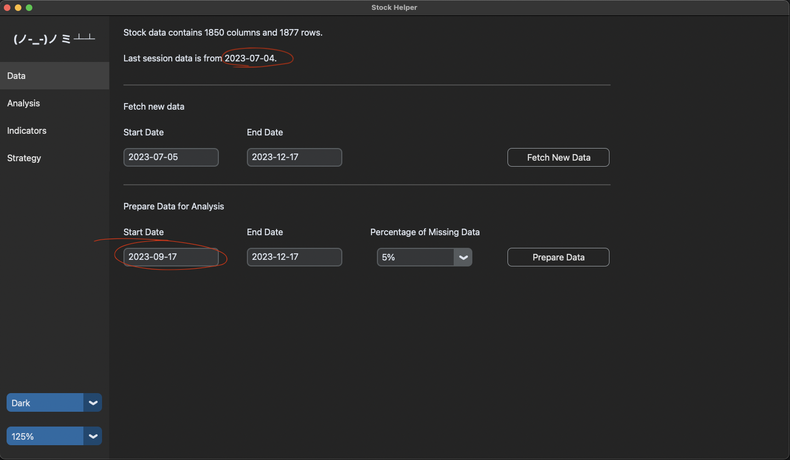
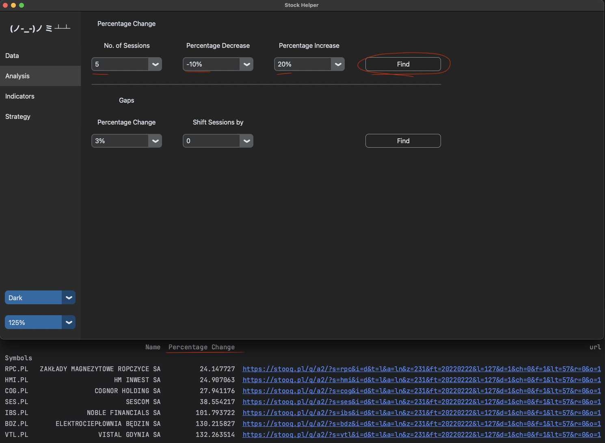
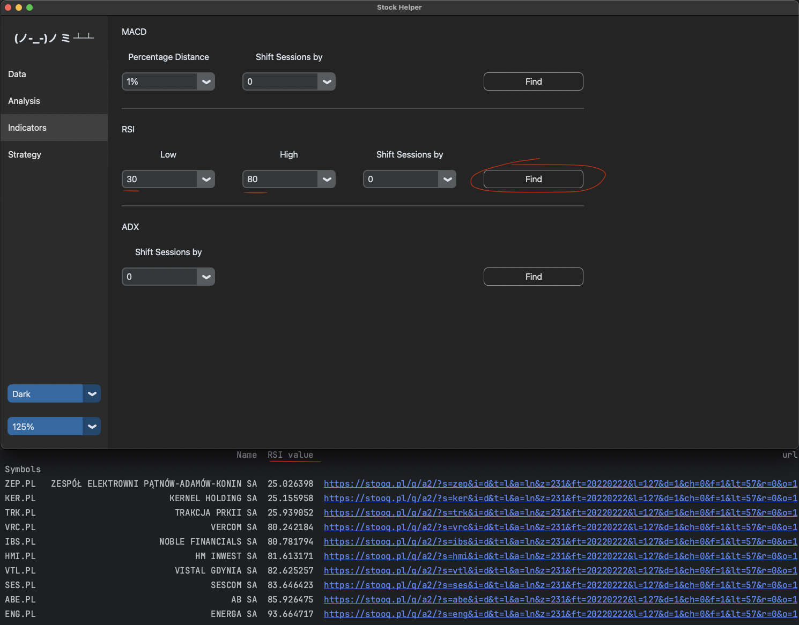

# StockHelper

My first project.

I wanted to practice with pandas library.

My lack of knowledge on the stock market subject hindered this project significantly.

The output is displayed in the console window.


### Data
Stock data is pulled from stooq. Stooq provides: Open, Close, Low, High and Volume.
There is a limit of 500 requests per  day. The app is pulling data for ticker symbols stored in gpw_tickers.py.
In "Data" tab you have to push "Prepare Data" button before moving to "Analysis" or "Indicators" tab.


### Analysis
**Percentage Change** - it is looking for stock which value changed by chosen percentage over chosen number of sessions.

**Gaps** - it is looking for stock which open value changed by chosen percentage compared to close value from previous
day.
Then it drops stock if low value is less than close value from previous day for positive change and when high value
is greater than close value from previous day for negative change. My assumption can be wrong.


### Indicators
**MACD** - it is looking for stock which MACD and signal line are close enough (distance is less than chosen percentage).

**RSI** - it is looking for stock which RSI is lower and higher than the chosen values.

**ADX** - it is looking for stock which ADX from previous session is less or equal to 20 and ADX from last session is
 greater than 20. My assumption can be wrong. ADX, +DM and - DM seem to be calculated properly.

### Strategy
Not implemented

### Preview
**The 'Data' window**

Included data is up to 4th of July 2023.
Please make sure that 'Start Date' is properly set before hitting 'Prepare Data'


**The 'Analysis' window**


**The 'Indicators' window**



### Installation

1. **Clone the Repository:**
    ```bash
    git clone https://github.com/rafald1/stockhelper.git
    cd stockhelper
    ```
2. **Create and Activate a Virtual Environment:**
    ```bash
    python -m venv .venv
    source .venv/bin/activate  # On macOS/Linux
    .\.venv\Scripts\activate   # On Windows
    ```
    Note: Python 3.12 cannot be used due to the removal of distutils.
    
    For macOS Sonoma consider using Python 3.11.7 (or later), which includes Tcl/Tk 8.6.13 that resolved issues
    with mouse clicks not properly registering in Tkinter.

3. **Install Dependencies:**
    ```bash
    pip install -r requirements.txt
    ```
4. **Run the Project:**
    ```bash
    python main.py
    ```